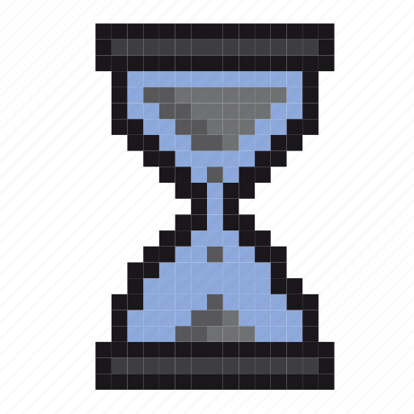

# Raylib Stopwatch

Simple stopwatch app which have the basic stopwatch features with ability to record time laps in text file named "Lap Record `Your Current Time`".

**Raylib** python API used with **time** and **datetime** libraries from python
